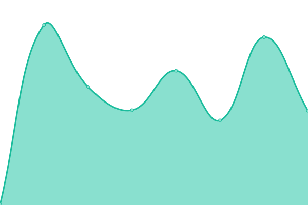

# [📈 Live Status](https://engeir.github.io/upptime): <!--live status--> **🟥 Complete outage**

This repository contains the open-source uptime monitor and status page for [Eirik Rolland Enger](linkedin.com/in/eirik-rolland-enger/), powered by [Upptime](https://github.com/upptime/upptime).

With [Upptime](https://upptime.js.org), you can get your own unlimited and free uptime monitor and status page, powered entirely by a GitHub repository. We use [Issues](https://github.com/engeir/upptime/issues) as incident reports, [Actions](https://github.com/engeir/upptime/actions) as uptime monitors, and [Pages](https://engeir.github.io/upptime) for the status page.

<!--start: status pages-->
<!-- This summary is generated by Upptime (https://github.com/upptime/upptime) -->
<!-- Do not edit this manually, your changes will be overwritten -->
<!-- prettier-ignore -->
| URL | Status | History | Response Time | Uptime |
| --- | ------ | ------- | ------------- | ------ |
|  [FlottFlyt](https://flottflyt.com) | 🟥 Down | [flott-flyt.yml](https://github.com/engeir/upptime/commits/HEAD/history/flott-flyt.yml) | 

 953ms
     
 | 

<a href="https://engeir.github.io/upptime/history/flott-flyt">94.22%</a>
    

|  [Eirik Rolland Enger](https://eirikenger.xyz) | 🟥 Down | [eirik-rolland-enger.yml](https://github.com/engeir/upptime/commits/HEAD/history/eirik-rolland-enger.yml) | 

 1028ms
     
 | 

<a href="https://engeir.github.io/upptime/history/eirik-rolland-enger">94.23%</a>
    

<!--end: status pages-->

[**Visit our status website →**](https://engeir.github.io/upptime)

## 📄 License

- Powered by: [Upptime](https://github.com/upptime/upptime)
- Code: [MIT](./LICENSE) © [Eirik Rolland Enger](linkedin.com/in/eirik-rolland-enger/)
- Data in the `./history` directory: [Open Database License](https://opendatacommons.org/licenses/odbl/1-0/)
